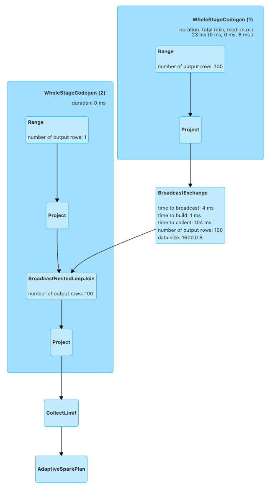
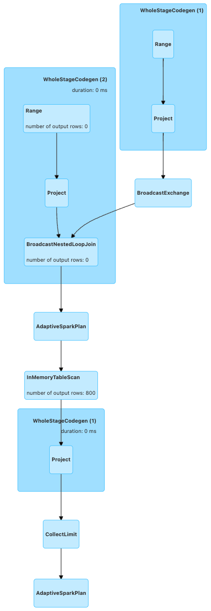
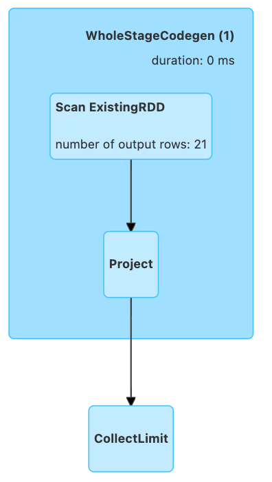
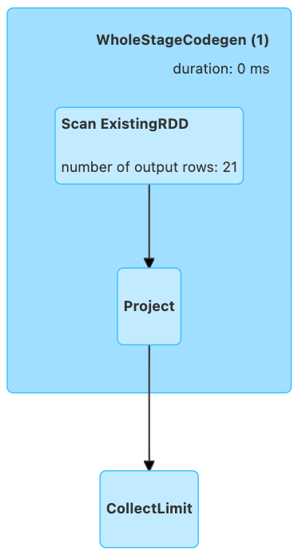
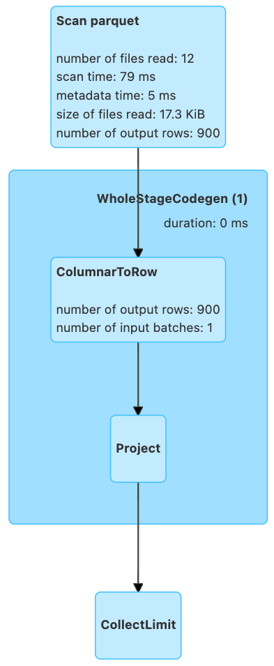
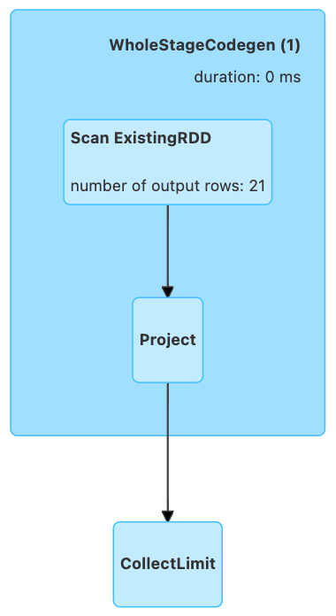
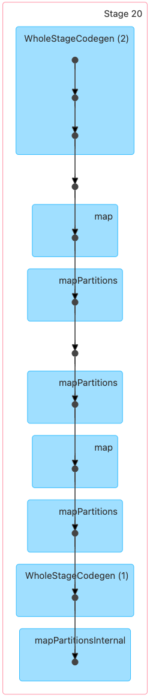
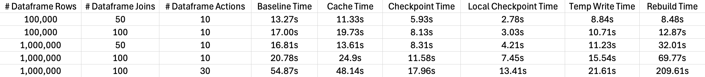

# When the Spark Execution Plan Gets Too Big

## Intro

Apache Spark has been the dominant big data processing tool for around a decade. It's popularity stems from it's multi-language support, fault-tolerance, performance, and scalability. One of it's unique features is it's execution plan which gets evaluated lazily to allow optimization once an "action" is called (i.e. a result is returned). Keeping the entire execution plan in memory is what helps Spark to be fault-tolerant -- that way it can rebuild the dataframe if a worker is lost. However, the execution plan can become quite extensive when performing many data transformations, potentially leading to bottlenecks in processing.


## Background

I've been a Data Engineer for around 3 years, and working with Spark for most of that, but I hadn't run into this problem until I joined State Farm a year ago. This is because State Farm has severely nested and complex data which requires us to perform many transformations on it. After these transformations, we noticed the applications would run slower, and the Spark UI would blow up in our faces when we tried to view the execution plan DAG. Then, I heard about certain methods of breaking up the lineage of the execution plan to alleviate this problem. After doing some research, I wanted to perform an in-depth analysis of these different options and understand how each one works.


## Scenario

To illustrate this, let's consider the following simple dataframe:
```python
df = spark.range(100)
```

Now let's perform a self cross-join to force a wide transformation:
```python
df_transformed = df.withColumnRenamed("id", "id1").crossJoin(df.withColumnRenamed("id", "id2"))
df_transformed.show()
```

Now we have a cartesian product of the numbers up to 100:
```python
+---+---+
|id1|id2|
+---+---+
|  0|  0|
|  0|  1|
|  0|  2|
|  0|  3|
|  0|  4|
|  0|  5|
|  0|  6|
|  0|  7|
|  0|  8|
|  0|  9|
|  0| 10|
|  0| 11|
|  0| 12|
|  0| 13|
|  0| 14|
|  0| 15|
|  0| 16|
|  0| 17|
|  0| 18|
|  0| 19|
+---+---+
only showing top 20 rows
```

Here's what the Spark execution plan for this dataframe looks like up to this point:



**Note:** I'm using the SQL section of the UI to get the execution plan DAG, as it tends to provide a better visual than the Jobs/Stages tabs

Although this is just one transformation, you can see how the DAG can grow large if you're doing many. For each transformation, Spark stores intermediate results, metrics, shuffle information, and execution context metadata. All of which utilize memory.

Let's say we want to perform further analysis on this dataframe, but we want to break up the execution plan. If you're like me, your first thought would be to cache the dataframe.


## Where Caching Falls Short

The reason caching isn't a great option is because it keeps the history of the execution plan prior to the cache. Again, this is for fault-tolerance purposes. Let's see an example to prove this:

```python
df_cache = df_transformed
df_cache.cache()
df_cache.count() # force caching
df_cache.show()
```

Here's what the execution plan DAG looks like from the `show()` action:



As you can see, the execution plan prior to the cache is still there.

Despite not helping here, caching should still be the go-to method when needing to reuse a dataframe. I don't suggest replacing caching with one of the methods outlined below, though you may consider combining them in certain scenarios.


## What Options Do We Have?

**Disclaimer:** Unless otherwise stated, I will be referring to the Pyspark Dataframe API. Dataset/RDD APIs may have slight differences.


### Checkpoint

The first option we have is dataframe checkpointing, not to be confused with Spark Streaming checkpointing. Dataframe checkpointing materializes and stores the dataframe's underlying RDD to a directory. This can be a local temp directory, distributed filesystem like HDFS, or object store like S3. There, it is replicated to ensure fault-tolerance. For this to work, you must specify the directory to store the RDD files. You must also reassign the dataframe from the output of the `checkpoint` method to properly retrieve the checkpointed dataframe.

Here's how this works in practice:
```python
df_checkpoint = df_transformed
spark.sparkContext.setCheckpointDir("./checkpoint") # specify location of RDD files
df_checkpoint = df_checkpoint.checkpoint() # returns checkpointed dataframe
df_checkpoint.show()
```

**Note:** The `checkpoint` method can also be lazily evaluated, like caching. To do this, set the `eager` argument to False.

This stores serialized RDD files in the `.checkpoint/` directory. Now let's see what the execution plan DAG looks like from the `show()`. 



Voila! It's now reading from the stored RDD files, and has essentially forgotten about what happened prior to that. The total size of the RDD files from this sample dataframe was 425 KB.

A few other notes:
- The stored RDD files will not automatically disappear after your SparkSession ends, so it may require extra cleanup depending on your cluster setup and where you store the files.
- When checkpointing an RDD directly (not the dataframe), it's recommended to cache the RDD before checkpointing. This is because there are actually 2 jobs happening on the RDD, requiring recomputation. For more info on RDD checkpointing, check out [the docs](https://spark.apache.org/docs/latest/api/python/reference/api/pyspark.RDD.checkpoint.html).


### LocalCheckpoint:

Similar to checkpointing, local checkpointing also materializes the dataframe's RDD. However, this gets stored in memory rather than on disk, making it perform faster. This makes it work the same as caching, but without keeping the prior execution plan. The storage level that gets used is `MEMORY_AND_DISK_DESER`, just like the cache default, though it doesn't appear to be configurable. The problem with local checkpointing is that it's not fault-tolerant, meaning that if you lose an executor, the RDD will not be able to be reconstructed because it doesn't have the transformations that created it. This is especially troublesome if:
- you're using dynamic allocation within your cluster, which can drop executors
- you're using auto-scaling with a service like AWS Glue/EMR, which can also drops workers
- you're using AWS Spot Instances for your workers, which can be interrupted or shut down at any time

I recommend avoiding dataframe local checkpointing except for one-off cases, like adhoc analysis notebooks where you can afford things to fail.

Here's how this looks in code:
```python
df_local_checkpoint = df_transformed
df_local_checkpoint = df_local_checkpoint.localCheckpoint() # need to reassign the df just like checkpoint
df_local_checkpoint.show()
```

Here's what the execution plan DAG looks like:



It looks just like the checkpointing DAG looked, which is to be expected. One difference is that the stored files in memory are almost twice as big as checkpointing -- in total they're 840 KB. This is likely due to them not being serialized, which provides quicker access to them.


### Temporary Write to Disk:

The third option is explicitly writing the dataframe to disk, and reading it back. This allows flexibility because you can write the dataframe anywhere, even your preferred database. It also allows storage-optimized file types like parquet which occupy less space and may incur less external storage costs as well. Here's how you can implement this:

```python
df_temp_write = df_transformed
df_temp_write.write.mode("overwrite").parquet("./temp_write")
df_temp_write = spark.read.parquet("./temp_write")
df_temp_write.show()
```

Which provides the following DAG:



This is slightly different from the other DAGs because it needs to translate the parquet files to an RDD. Therefore, if you plan on re-using this dataframe, you may want to cache it after reading it from the temporary location.

This option, like checkpointing, will likely require manual cleanup of the files. However, there is less data to cleanup because of the optimized storage. For this example, the parquet files amounted to just 18 KB! It's also worth mentioning that the ordering of the dataframe can be different when reading it back, so you may need to sort it when writing the files.


### Rebuilding the Dataframe from the RDD:

I saw a few examples online of people saying that recreating the dataframe from the RDD and the schema will effectively break up the execution plan just like the other options. Here's how it would work:

```python
df_rebuild = df_transformed
df_rebuild = spark.createDataFrame(df_rebuild.rdd, df_rebuild.schema)
df_rebuild.show()
```

This appears to work when looking at the DAG in the SQL section of the Spark UI:



However, if we look at the DAG from the Job, we'll see a different story:



This appears to show the original `df_transformed` execution plan with a few extra steps of converting it to an RDD and back to a dataframe. I believe it's misleading on the SQL diagram because the transformation is happening with the RDDs which is at a lower level than the SQL interface. Since this doesn't actually break up the execution plan, this isn't a viable option.


## Comparison

In attempt to get a comparison of these methods, I designed an experiment which creates a dataframe, runs a bunch of transformations on it to build up the execution plan, then iteratively performs a certain number of actions which reuse the dataframe. Before the last step, I tried out each strategy outlined above to see how it impacted the resulting processing time.

One hurdle I encountered when designing this was Spark implicitly storing some of the results, which would make the first test always run slower than the following tests. To get past this, I introduced randomness so that each test would calculate slightly different aggregates.

The 3 major variables which I expect to impact the performance are:
1. Size of the dataframe
2. Size of the execution plan
3. Number of times we reuse the dataframe

Therefore, I ran this experiment with a few different values for each of these. Here are the results:



The first column `# Dataframe Rows` simply represents how big the dataframe is. The second column `# Dataframe Transformations` represents how big the Spark execution plan is. The third column `# Dataframe Actions` is how many times I reuse the dataframe after implementing each strategy. This is all local, so I ran into memory errors when trying to go past these numbers. The `Baseline Time` column is how long the code took when I didn't implement any strategy.

A few interesting things to note with these results:
- Caching performed relatively poorly in each test, and even worse than the baseline in two of them
- Local checkpointing, despite it's risks, outperformed the others in all tests
- Checkpointing performed slightly better than temp writes in each test, however, temp writes seemed to be getting better when we increased our variables
- Rebuilding the dataframe surprisingly performed well when our dataframe was small, but degraded severely when it grew

Of course, these will not always hold to be true. Another potential factor which I didn't explore is the complexity of the dataframe actions we're performing after the strategy. In my experiment, we run a simple filter and sum aggregation on a single column, but doing something more complex might change which strategy performs the best.

The full code I used for my experiment can be found [here](github.com)


## Which to Use?

As with most Spark applications, there's not one solution that will work the best for everyone. Therefore, I recommend experimenting with the above methods, and determining which provides the most uplift for your situation. With that being said, there are a few conclusions we can accurately draw:
1. Caching should still be the default when you need to reuse a daframe which doesn't have a big execution plan.
2. Local Checkpointing is generally the most efficient strategy to break up your execution plans. However, there are major drawbacks when it comes to fault-tolerance.
3. The next best option is typically either checkpointing or temporarily writing to disk. These tend to perform similarly.

For our application, we found that temp writes with caching afterwards was the best option.


## Departing Thoughts

Breaking up the execution plan can help out with any Spark applications where you are reusing a dataframe. We found it to be useful in our data processing pipelines, but I've seen mentions of it being used in MLlib and GraphX apps as well.

Please don't be afraid to reach out with any questions or thoughts!

All of the code I used is available on [my github](github.com)

During my research, I found the following resources especially helpful:
- https://www.getorchestra.io/guides/spark-concepts-pyspark-sql-dataframe-checkpoint-getting-started
- https://github.com/JerryLead/SparkInternals/blob/master/markdown/english/6-CacheAndCheckpoint.md
- https://jaceklaskowski.gitbooks.io/mastering-spark-sql/content/spark-sql-checkpointing.html


